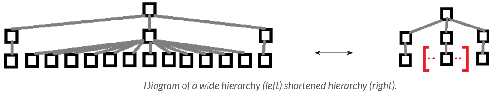

# Potential Enhancements

Here is a ranking of additions/changes that might be interesting to include.

## Must have

- Display the hierarchy on a panel and allow moving the panel  
  *(The goal is to modify the tags in the hierarchy while having the ViRMA display.)*     
- Zoom *(Use the joysticks: one to move the hierarchy, the other to zoom in/out).*    
- Delete Branch *(Delete a node and all its child nodes below).*    
- When deleting, allow reattaching the children to the grandparent *(P+2 parent).*     
- Search for a node by its name within a hierarchy.     
- Implement security in the API to prevent creating loops in hierarchies  
  *(e.g., root → child1 → child1_1 → root → …).*    
   

## Could be interesting

- Inter-hierarchy movement *(Drag and drop a node from a hierarchy into another one).*
- Optimize display refresh during modifications *(Refresh only the visual of the node modified instead of every nodes).*
- Rollback function *(Async between Unity and the DB with a commit button).*
- Shorten wide nodes *(In case we choose to work on wide hierarchies).*

## Additional ideas

- Add parent *(Evolution of “Add node”: If the name given in “Add node” already exists, then the node with that name becomes the parent of the current node. If the name is unknown, a child node is created for the current node).*
